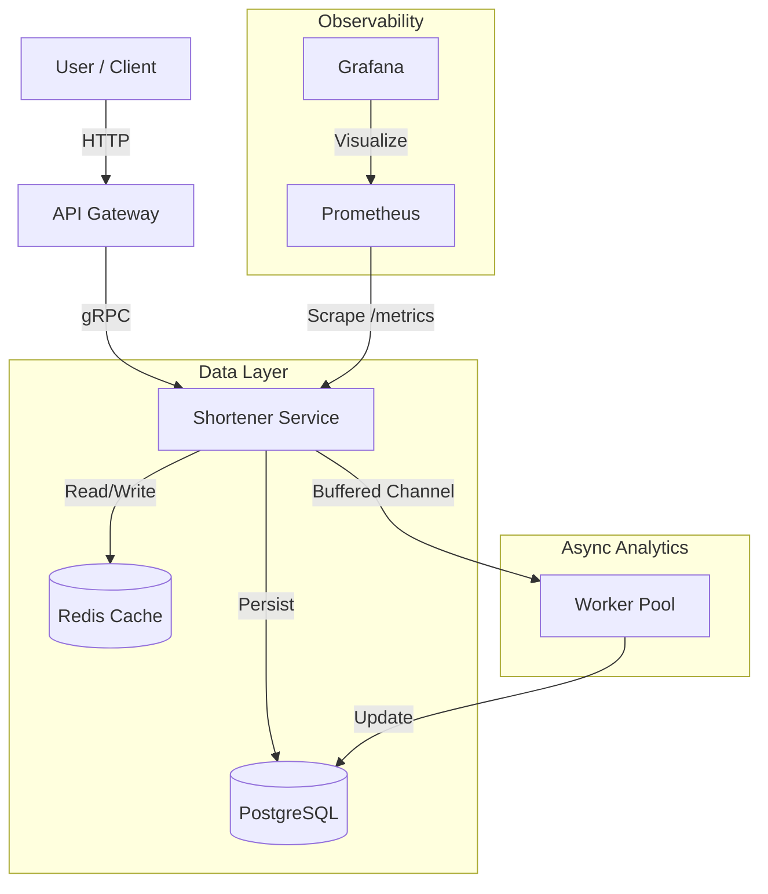

# 🚀 Distributed URL Shortener (Go, gRPC, Redis, Postgres)

A high-performance, distributed microservices system for shortening URLs and tracking analytics. Built with **Go**, **gRPC**, **Postgres**, **Redis**, and **Prometheus**.


## 🏗 Architecture

The system uses a **Microservices Architecture** with a clear separation of concerns:
1.  **API Gateway (HTTP):** Handles external traffic and forwards requests via gRPC.
2.  **Shortener Service (gRPC):** Core business logic, database interaction, and caching.
3.  **Async Worker:** A background worker pool for processing analytics without blocking the user.


## ✨ Key Features
**Microservices Communication**: High-performance inter-service communication using gRPC and Protobuf.

**Cache-Aside Pattern**: Uses Redis to cache hot URLs, reducing database load and latency (99% cache hit ratio target).

**Asynchronous Analytics**: Non-blocking click tracking using Go Channels and Worker Pools. User redirects happen instantly; stats are processed in the background.

**Optimistic Locking**: Handles ID collisions gracefully with a retry mechanism.

**Graceful Shutdown**: Ensures no data loss during deployments by draining the analytics buffer before exiting.

**Observability**: Fully instrumented with Prometheus metrics (RPS, Latency) and Grafana dashboards.

**Containerization**: Full Docker Compose setup for one-command deployment.

## 🚀 Performance Benchmarks
The system was stress-tested using **k6** to validate the high-performance gRPC and Redis caching layers.

WRITE TEST
| Metric | Result |
| :--- | :--- |
| **Throughput** | **7727.905 req/s** |
| **Success Rate** | 100% (0 errors) |
| **Avg Latency** | 12.81 ms |
| **P95 Latency** | 23.74 ms |

READ TEST
| Metric | Result |
| :--- | :--- |
| **Throughput** | **12210.508 req/s** |
| **Success Rate** | 100% (0 errors) |
| **Avg Latency** | 8.000 ms |
| **P95 Latency** | 17.36 ms |
> Results based on a 30s test with 100 concurrent Virtual Users (VUs).

## 🛠 Tech Stack
**Language**: Go (Golang)

**Transport**: gRPC, HTTP/1.1 

**Database**: PostgreSQL (pgx driver)

**Cache**: Redis

**DevOps**: Docker, Docker Compose

**Monitoring**: Prometheus, Grafana

## 🚀 Getting Started

### 1. Clone & Run
Execute the following commands to spin up the entire stack using Docker:

```bash
git clone https://github.com/JoYBoy7214/distributed_shortener.git
cd distributed_shortener/deployments
docker compose up --build
```
**Gateway**: http://localhost:8080

**Prometheus**: http://localhost:9091

**Grafana**: http://localhost:3000 (User: admin, Pass: admin)

### 2. Test the API
Shorten a URL:

```bash
curl -X POST http://localhost:8080/submit \
  -d '{"OriginalUrl": "https://google.com", "UserId": "user_1"}'
```
Access a Short URL (Redirect):

```bash
# Replace {short_id} with the ID from the previous step
curl -v http://localhost:8080/{short_id}
```
View Metrics: Open http://localhost:3000 in your browser to see Real-Time Traffic and Latency.

### 📂 Project Structure
```bash
.
├── api/
│   └── proto/          # gRPC Protobuf definitions
├── cmd/
│   ├── gateway/        # HTTP Gateway entrypoint
│   └── shortener/      # gRPC Service entrypoint
├── deployments/        # Dockerfiles and Compose configs
├── internal/
│   ├── shortener/      # Business Logic (Service Layer)
│   └── storage/        # Database Interface (Repository Pattern)
│       ├── postgres/   # Real Postgres implementation
│       └── memory/     # Mock implementation for tests
├── go.mod
└── README.md
```
## 🧠 Design Decisions
Why Async Analytics? 

Writing to the database on every click (redirect) adds unnecessary latency to the user experience. By pushing click events to a buffered channel, the redirect happens instantly (0ms overhead), and the worker updates the DB asynchronously.

Why Cache-Aside?

URL shorteners have a high Read-to-Write ratio. Redis sits in front of Postgres to handle traffic spikes (e.g., viral links). If Redis is down, the system "fails open" and gracefully degrades to reading from the DB.

Why gRPC?

Internal communication between the Gateway and Service needs to be fast and type-safe. Protobuf contracts ensure strict interface adherence between services.
